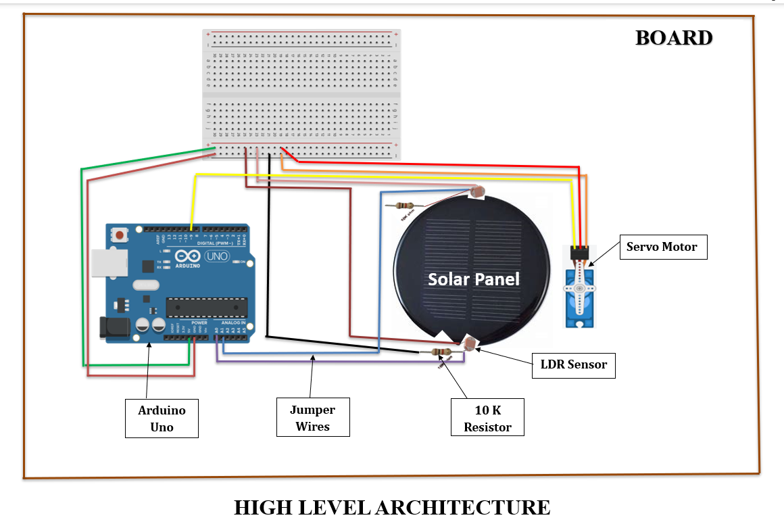

# IoT-Based Solar Tracking System

## 📌 Overview
The **IoT-Based Solar Tracking System** enhances solar panel efficiency by dynamically adjusting its position according to the sun's movement. The system uses **Arduino Uno, LDR sensors, and a servo motor** to optimize sunlight absorption and improve electricity generation.

## 🚀 Key Features
- **Automated Sun Tracking** using LDR sensors.
- **Arduino-Controlled Servo Motor** for precise movement.
- **180° Panel Rotation** for maximum energy capture.
- **Efficient Power Management** for continuous operation.
- **Cost-Effective & Scalable Design** for easy integration.

## 🛠️ System Components

- **Arduino Uno** (Microcontroller)
- **Light Dependent Resistors (LDRs)**
- **Servo Motor**
- **Solar Panel**
- **10k Ohm Resistors**
- **Jumper Wires & MDF Board**

## 🔧 Modules
1. **Sun Tracking System** - Detects sunlight intensity and adjusts panel angle.
2. **Servo Motor Control** - Moves the panel based on sensor data.
3. **Solar Panel Mounting** - Provides stability for optimized performance.
4. **Power Supply Management** - Regulates energy flow to the system.

## ⚙️ Specifications
### **Hardware:**
- Arduino Uno, Servo Motor, Solar Panel, LDR, Resistors, MDF Board
### **Software:**
- Arduino IDE, C/C++ Programming, Servo Library

## 📊 Installation & Usage
1. **Connect the components** as per the circuit diagram.
2. **Upload the code** using Arduino IDE.
3. **Power the system** and place it under sunlight.
4. **Observe real-time tracking** as the panel follows the sun.

## 🚀 Future Improvements
- Integration with IoT for remote monitoring
- Battery storage management
- AI-based predictive tracking

